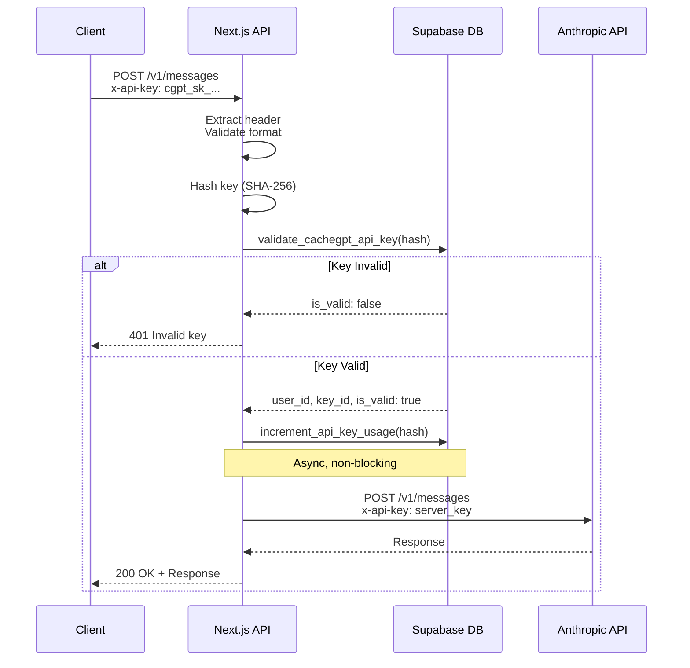

# CacheGPT Authentication Flow & API Key System

## Executive Summary

CacheGPT implements a **three-tier authentication system** with API keys as the primary programmatic access method. This document provides a complete technical specification of the authentication flow, common failure modes, and diagnostic procedures.

**Last Updated**: October 22, 2025
**System Version**: v12.1.0
**Status**: Production (https://cachegpt.app)

---

## Table of Contents

1. [System Architecture](#system-architecture)
2. [Authentication Methods](#authentication-methods)
3. [API Key System Deep Dive](#api-key-system-deep-dive)
4. [Request Flow Diagram](#request-flow-diagram)
5. [Common Failure Modes](#common-failure-modes)
6. [Troubleshooting Guide](#troubleshooting-guide)
7. [Security Considerations](#security-considerations)
8. [Testing & Validation](#testing--validation)

---

## System Architecture

### High-Level Components

```
┌─────────────────────────────────────────────────────────────┐
│                         Consumer                            │
│  (External apps, CLI tools, Browser clients)               │
└────────────────────────────┬────────────────────────────────┘
                             │
                             │ HTTP(S) + Headers
                             │
                ┌────────────▼─────────────┐
                │   Next.js API Routes     │
                │  (Authentication Layer)  │
                └────────────┬─────────────┘
                             │
        ┌────────────────────┼────────────────────┐
        │                    │                    │
        ▼                    ▼                    ▼
┌───────────────┐   ┌────────────────┐   ┌──────────────┐
│  API Key Auth │   │  Bearer Token  │   │   Cookie     │
│  (cgpt_sk_*)  │   │  (Supabase JWT)│   │   Session    │
└───────┬───────┘   └────────┬───────┘   └──────┬───────┘
        │                    │                    │
        └────────────────────┼────────────────────┘
                             │
                    ┌────────▼─────────┐
                    │  Supabase         │
                    │  - Auth (users)   │
                    │  - DB (API keys)  │
                    │  - RLS policies   │
                    └────────┬─────────┘
                             │
                    ┌────────▼─────────┐
                    │  Downstream APIs │
                    │  - Anthropic API │
                    │  - OpenAI API    │
                    │  - Google AI     │
                    └──────────────────┘
```

### File Structure

```
/home/rolo/cachegpt/
├── app/api/
│   ├── api-keys/route.ts              # Issuer: Generate/list/revoke keys
│   ├── v1/messages/route.ts           # Consumer: Anthropic-compatible endpoint
│   └── v2/unified-chat/route.ts       # Consumer: Multi-provider chat
├── lib/
│   ├── api-key-auth.ts                # API key validation logic
│   ├── api-key-validator.ts           # Provider key format validation
│   └── unified-auth-resolver.ts       # Unified auth priority resolver
├── database-scripts/
│   └── 030_cachegpt_api_keys.sql     # Schema + RPC functions
└── tools/repro/                       # Testing & reproduction scripts
    ├── README.md
    ├── test-api-key-auth.js
    ├── generate-test-key.sh
    ├── test-cors-preflight.sh
    └── test-minimal-client.html
```

---

## Authentication Methods

CacheGPT resolves authentication using **priority-based fallback**:

### Priority 1: CacheGPT API Keys (`cgpt_sk_*`)

**Purpose**: Programmatic access for external applications

**Header**: `x-api-key: cgpt_sk_...`

**Use Cases**:
- Third-party integrations
- Server-to-server communication
- Automated workflows
- CI/CD pipelines

**Files**:
- Validation: `lib/api-key-auth.ts:35-88`
- Extraction: `lib/api-key-auth.ts:94-110`
- Consumption: `app/api/v1/messages/route.ts:24-36`

### Priority 2: Bearer Tokens (Supabase JWT)

**Purpose**: User session authentication for CLI and OAuth users

**Header**: `Authorization: Bearer <jwt>`

**Use Cases**:
- CLI tool (`cachegpt` command)
- OAuth-based logins
- Temporary sessions

**Files**:
- Validation: `lib/unified-auth-resolver.ts:112-163`
- Fallback: `lib/unified-auth-resolver.ts:71-88`

### Priority 3: Cookie Sessions

**Purpose**: Browser-based web app authentication

**Storage**: HTTP-only cookies managed by Supabase Auth

**Use Cases**:
- Web app users (https://cachegpt.app)
- Persistent browser sessions

**Files**:
- Validation: `lib/unified-auth-resolver.ts:168-219`
- Fallback: `lib/unified-auth-resolver.ts:91-100`

---

## API Key System Deep Dive

### Key Format

```
cgpt_sk_<64 hexadecimal characters>
         └─ 32 random bytes (crypto.randomBytes(32))

Total length: 8 (prefix) + 64 (hex) = 72 characters
```

**Example**: `cgpt_sk_a1b2c3d4e5f6789012345678901234567890abcdef1234567890abcdef123456`

### Key Generation Flow

```javascript
// File: app/api/api-keys/route.ts:11-19

function generateApiKey(): string {
  const randomBytes = crypto.randomBytes(32);
  return `cgpt_sk_${randomBytes.toString('hex')}`;
}

function hashApiKey(apiKey: string): string {
  return crypto.createHash('sha256').update(apiKey).digest('hex');
}
```

**Security Properties**:
- **Entropy**: 256 bits (32 bytes)
- **Collision Probability**: ~1 in 2^256
- **Brute Force Resistance**: Computationally infeasible
- **Hash Algorithm**: SHA-256 (FIPS 140-2 compliant)

### Database Schema

```sql
-- File: database-scripts/030_cachegpt_api_keys.sql

CREATE TABLE cachegpt_api_keys (
  id UUID PRIMARY KEY DEFAULT gen_random_uuid(),
  user_id UUID REFERENCES auth.users(id) ON DELETE CASCADE NOT NULL,
  key_name TEXT NOT NULL,                    -- User-friendly identifier
  key_hash TEXT NOT NULL UNIQUE,             -- SHA-256 hash (never plaintext)
  key_prefix TEXT NOT NULL,                  -- First 16 chars for UI display
  last_used_at TIMESTAMP WITH TIME ZONE,
  usage_count INTEGER DEFAULT 0,
  is_active BOOLEAN DEFAULT TRUE,
  created_at TIMESTAMP WITH TIME ZONE DEFAULT NOW(),
  expires_at TIMESTAMP WITH TIME ZONE,       -- Optional expiration
  metadata JSONB DEFAULT '{}'::jsonb
);

-- Indexes for fast lookup
CREATE INDEX idx_cachegpt_api_keys_key_hash
  ON cachegpt_api_keys(key_hash) WHERE is_active = true;
```

### Validation RPC Function

```sql
-- File: database-scripts/030_cachegpt_api_keys.sql:66-78

CREATE OR REPLACE FUNCTION validate_cachegpt_api_key(api_key_hash TEXT)
RETURNS TABLE(user_id UUID, key_id UUID, is_valid BOOLEAN) AS $$
BEGIN
  RETURN QUERY
  SELECT
    k.user_id,
    k.id AS key_id,
    (k.is_active AND (k.expires_at IS NULL OR k.expires_at > NOW())) AS is_valid
  FROM cachegpt_api_keys k
  WHERE k.key_hash = api_key_hash
  LIMIT 1;
END;
$$ LANGUAGE plpgsql SECURITY DEFINER;
```

**Validation Checks**:
1. ✅ Key hash exists in database
2. ✅ `is_active = true` (not revoked)
3. ✅ `expires_at IS NULL OR expires_at > NOW()` (not expired)

### Usage Tracking

```sql
-- File: database-scripts/030_cachegpt_api_keys.sql:81-90

CREATE OR REPLACE FUNCTION increment_api_key_usage(api_key_hash TEXT)
RETURNS VOID AS $$
BEGIN
  UPDATE cachegpt_api_keys
  SET
    usage_count = usage_count + 1,
    last_used_at = NOW()
  WHERE key_hash = api_key_hash;
END;
$$ LANGUAGE plpgsql SECURITY DEFINER;
```

**Invocation**: Async, non-blocking (fire-and-forget)

```javascript
// File: app/api/v1/messages/route.ts:65-66
supabase.rpc('increment_api_key_usage', { api_key_hash: keyHash })
```

---

## Request Flow Diagram

### `/v1/messages` Endpoint (Anthropic-Compatible)

```
┌─────────────────────────────────────────────────────────────┐
│                      Client Application                      │
└────────────────────────────┬────────────────────────────────┘
                             │
                             │ POST /api/v1/messages
                             │ Headers:
                             │   - Content-Type: application/json
                             │   - x-api-key: cgpt_sk_...
                             │
                             ▼
┌─────────────────────────────────────────────────────────────┐
│  OPTIONS Preflight (CORS)                                   │
│  - Check: Origin, Access-Control-Request-Headers            │
│  - Return: Allow-Origin: *, Allow-Headers: x-api-key        │
└────────────────────────────┬────────────────────────────────┘
                             │
                             ▼
┌─────────────────────────────────────────────────────────────┐
│  Extract x-api-key Header                                   │
│  File: app/api/v1/messages/route.ts:24                     │
│  - Check: Header exists                                     │
│  - Check: Starts with 'cgpt_sk_'                           │
└────────────────────────────┬────────────────────────────────┘
                             │
                             ▼
┌─────────────────────────────────────────────────────────────┐
│  Hash API Key                                               │
│  File: app/api/v1/messages/route.ts:50                     │
│  - Algorithm: SHA-256                                       │
│  - Output: 64-char hex string                              │
└────────────────────────────┬────────────────────────────────┘
                             │
                             ▼
┌─────────────────────────────────────────────────────────────┐
│  Validate via Database RPC                                  │
│  File: app/api/v1/messages/route.ts:53-61                 │
│  - Call: validate_cachegpt_api_key(hash)                   │
│  - Returns: user_id, key_id, is_valid                      │
└────────────────────────────┬────────────────────────────────┘
                             │
                    ┌────────┴────────┐
                    │                 │
                    ▼                 ▼
              ┌──────────┐      ┌──────────┐
              │  Valid   │      │ Invalid  │
              └────┬─────┘      └────┬─────┘
                   │                 │
                   │                 └─→ 401 Unauthorized
                   │                      "Invalid or expired API key"
                   ▼
┌─────────────────────────────────────────────────────────────┐
│  Increment Usage Counter (Async)                            │
│  File: app/api/v1/messages/route.ts:66                     │
│  - Call: increment_api_key_usage(hash)                     │
│  - Non-blocking (fire-and-forget)                          │
└────────────────────────────┬────────────────────────────────┘
                             │
                             ▼
┌─────────────────────────────────────────────────────────────┐
│  Call Anthropic API with Server Key                         │
│  File: app/api/v1/messages/route.ts:68-103                 │
│  - Uses: process.env.ANTHROPIC_API_KEY                     │
│  - SDK: @anthropic-ai/sdk (v0.67.0)                        │
│  - Model: From request body                                 │
└────────────────────────────┬────────────────────────────────┘
                             │
                             ▼
┌─────────────────────────────────────────────────────────────┐
│  Return Response to Client                                  │
│  - Format: Anthropic Messages API compatible                │
│  - Status: 200 OK                                           │
│  - Body: { id, content, model, role, ... }                 │
└─────────────────────────────────────────────────────────────┘
```

---

## Common Failure Modes

### 1. Header Name Mismatch

**Symptom**: 401 "Invalid or missing x-api-key header"

**Root Cause**: Client sends `Authorization` header instead of `x-api-key`

**Example**:
```bash
# ❌ Wrong
curl -H "Authorization: Bearer cgpt_sk_..." https://cachegpt.app/api/v1/messages

# ✅ Correct
curl -H "x-api-key: cgpt_sk_..." https://cachegpt.app/api/v1/messages
```

**Code Location**: `app/api/v1/messages/route.ts:25-26`

```typescript
const apiKey = request.headers.get('x-api-key')  // Must be lowercase 'x-api-key'
if (!apiKey) {
  return NextResponse.json(
    { error: 'Invalid or missing x-api-key header. Expected format: cgpt_sk_...' },
    { status: 401 }
  )
}
```

**Fix**: Update client to use `x-api-key` header

---

### 2. Key Format Validation Failure

**Symptom**: 401 "Invalid or missing x-api-key header"

**Root Cause**: Key doesn't start with `cgpt_sk_`

**Example**:
```bash
# ❌ Wrong formats
x-api-key: sk-ant-...        # Anthropic key (wrong provider)
x-api-key: sk-proj-...       # OpenAI key (wrong provider)
x-api-key: cgptsk_abc123     # Missing underscore

# ✅ Correct format
x-api-key: cgpt_sk_<64 hex chars>
```

**Code Location**: `app/api/v1/messages/route.ts:30-32`

```typescript
if (!apiKey.startsWith('cgpt_sk_')) {
  return null
}
```

**Fix**: Ensure key is generated via `/api/api-keys` endpoint

---

### 3. Database Validation Failure

**Symptom**: 401 "Invalid or expired API key"

**Root Causes**:
- Key hash not found in database
- `is_active = false` (key was revoked)
- `expires_at < NOW()` (key expired)

**Debugging SQL**:
```sql
-- Check if key exists and its status
SELECT
  id,
  key_name,
  is_active,
  expires_at,
  created_at,
  last_used_at,
  usage_count
FROM cachegpt_api_keys
WHERE key_hash = encode(sha256('cgpt_sk_YOUR_KEY_HERE'::bytea), 'hex');
```

**Code Location**: `app/api/v1/messages/route.ts:53-61`

```typescript
const { data: keyData, error: keyError } = await supabase
  .rpc('validate_cachegpt_api_key', { api_key_hash: keyHash })

if (keyError || !keyData || keyData.length === 0 || !keyData[0].is_valid) {
  return NextResponse.json(
    { error: 'Invalid or expired API key' },
    { status: 401 }
  )
}
```

**Fixes**:
- Re-generate key if deleted
- Reactivate key: `UPDATE cachegpt_api_keys SET is_active = true WHERE id = '...'`
- Extend expiry: `UPDATE cachegpt_api_keys SET expires_at = NOW() + INTERVAL '30 days' WHERE id = '...'`

---

### 4. CORS Preflight Failure

**Symptom**: Browser error "CORS policy: No 'Access-Control-Allow-Origin' header"

**Root Cause**: Missing or incorrect CORS headers in OPTIONS response

**Expected Headers**:
```
Access-Control-Allow-Origin: *
Access-Control-Allow-Methods: POST, OPTIONS
Access-Control-Allow-Headers: Content-Type, x-api-key, anthropic-version
```

**Code Location**: `app/api/v1/messages/route.ts:125-134`

```typescript
export async function OPTIONS(request: NextRequest) {
  return new NextResponse(null, {
    status: 200,
    headers: {
      'Access-Control-Allow-Origin': '*',
      'Access-Control-Allow-Methods': 'POST, OPTIONS',
      'Access-Control-Allow-Headers': 'Content-Type, x-api-key, anthropic-version'
    }
  })
}
```

**Testing**:
```bash
curl -X OPTIONS https://cachegpt.app/api/v1/messages \
  -H "Origin: https://example.com" \
  -H "Access-Control-Request-Method: POST" \
  -H "Access-Control-Request-Headers: content-type,x-api-key" \
  -v
```

**Fix**: Ensure `x-api-key` is in `Access-Control-Allow-Headers`

---

### 5. Missing Server API Key

**Symptom**: 500 "Anthropic API key not configured on server"

**Root Cause**: `ANTHROPIC_API_KEY` environment variable not set

**Code Location**: `app/api/v1/messages/route.ts:69-76`

```typescript
const anthropicApiKey = process.env.ANTHROPIC_API_KEY

if (!anthropicApiKey) {
  return NextResponse.json(
    { error: 'Anthropic API key not configured on server' },
    { status: 500 }
  )
}
```

**Fix**: Add to `.env.local`:
```bash
ANTHROPIC_API_KEY=sk-ant-api03-your_key_here
```

---

### 6. Database Migration Not Applied

**Symptom**: 500 "function validate_cachegpt_api_key does not exist"

**Root Cause**: Migration `030_cachegpt_api_keys.sql` not applied

**Verification**:
```sql
SELECT routine_name, routine_type
FROM information_schema.routines
WHERE routine_name IN ('validate_cachegpt_api_key', 'increment_api_key_usage');
```

**Fix**:
```bash
PGPASSWORD="$SUPABASE_DB_PASSWORD" psql \
  -h "your-host.supabase.com" \
  -p 6543 \
  -d "postgres" \
  -U "postgres.your_project" \
  -f database-scripts/030_cachegpt_api_keys.sql
```

---

### 7. RLS Policy Blocking Access

**Symptom**: Database function returns no rows despite key existing

**Root Cause**: Row Level Security blocking `anon` role access

**Verification**:
```sql
-- Check RLS policies on cachegpt_api_keys table
SELECT tablename, policyname, permissive, roles, cmd, qual
FROM pg_policies
WHERE tablename = 'cachegpt_api_keys';

-- Check grants for anon role
SELECT grantee, privilege_type
FROM information_schema.role_table_grants
WHERE table_name = 'cachegpt_api_keys' AND grantee = 'anon';
```

**Fix**: Ensure `anon` role has SELECT permission (already in migration):
```sql
GRANT SELECT ON public.cachegpt_api_keys TO anon;
GRANT EXECUTE ON FUNCTION validate_cachegpt_api_key(TEXT) TO anon;
```

---

## Troubleshooting Guide

### Quick Diagnostic Checklist

When authentication fails, run through this checklist:

1. **Client-Side Checks**
   - [ ] API key starts with `cgpt_sk_` (case-sensitive)
   - [ ] API key is 72 characters total (8 prefix + 64 hex)
   - [ ] Header name is exactly `x-api-key` (lowercase, hyphenated)
   - [ ] Header value has no extra whitespace or quotes
   - [ ] Content-Type header is `application/json`

2. **Server-Side Checks**
   - [ ] Migration `030_cachegpt_api_keys.sql` applied
   - [ ] Database functions exist: `validate_cachegpt_api_key`, `increment_api_key_usage`
   - [ ] Environment variable `ANTHROPIC_API_KEY` is set
   - [ ] Environment variable `SUPABASE_SERVICE_KEY` is set

3. **Database Checks**
   - [ ] Key exists: `SELECT * FROM cachegpt_api_keys WHERE key_prefix = 'cgpt_sk_first16chars'`
   - [ ] Key is active: `is_active = true`
   - [ ] Key not expired: `expires_at IS NULL OR expires_at > NOW()`
   - [ ] User exists: `SELECT * FROM auth.users WHERE id = 'user_id_from_key'`

4. **CORS Checks** (if browser client)
   - [ ] OPTIONS handler exists
   - [ ] `Access-Control-Allow-Origin` header returned
   - [ ] `Access-Control-Allow-Headers` includes `x-api-key`

### Debugging with Test Scripts

```bash
cd /home/rolo/cachegpt/tools/repro

# 1. Generate a test key
export SUPABASE_TOKEN="your_jwt_token"
./generate-test-key.sh

# 2. Test all auth scenarios
export CACHEGPT_API_KEY="cgpt_sk_..."
node test-api-key-auth.js

# 3. Test CORS preflight
./test-cors-preflight.sh

# 4. Test from browser
open test-minimal-client.html
```

### Verbose Logging

Enable debug logging in production (temporary):

```typescript
// app/api/v1/messages/route.ts

console.log('[DEBUG] Headers:', Object.fromEntries(request.headers.entries()));
console.log('[DEBUG] API Key:', apiKey ? `${apiKey.substring(0, 20)}...` : 'MISSING');
console.log('[DEBUG] Key Hash:', keyHash);
console.log('[DEBUG] Validation Result:', keyData);
```

---

## Security Considerations

### What is Stored vs. What is NOT

| Data | Stored? | Location | Format |
|------|---------|----------|--------|
| Full API key | ❌ NEVER | N/A | Shown once on creation |
| Key hash | ✅ YES | `cachegpt_api_keys.key_hash` | SHA-256 hex (64 chars) |
| Key prefix | ✅ YES | `cachegpt_api_keys.key_prefix` | First 16 chars (for UI) |
| User ID | ✅ YES | `cachegpt_api_keys.user_id` | UUID |
| Usage stats | ✅ YES | `usage_count`, `last_used_at` | Integer, Timestamp |

### Attack Surface Analysis

1. **Brute Force Key Guessing**: Infeasible (2^256 keyspace)
2. **Rainbow Table Attack**: Mitigated (unsalted SHA-256 is acceptable for 256-bit entropy)
3. **Timing Attack**: Not applicable (hash lookup is constant-time in database)
4. **Replay Attack**: Not mitigated (keys are bearer tokens, no nonce/timestamp)
5. **MITM Attack**: Mitigated by HTTPS (TLS 1.3)

### Recommended Security Practices

**For CacheGPT Developers**:
- ✅ Never log full API keys
- ✅ Use HTTPS only in production
- ✅ Implement rate limiting per key (future enhancement)
- ✅ Add IP allowlisting (optional, via `metadata` JSONB)
- ✅ Monitor for anomalous usage patterns

**For API Key Users**:
- ✅ Store keys in environment variables, not code
- ✅ Rotate keys every 90 days
- ✅ Use different keys for dev/staging/prod
- ✅ Revoke keys immediately if compromised
- ✅ Set expiration dates for temporary keys

---

## Testing & Validation

### Unit Tests

```typescript
// __tests__/api/api-key-auth.test.ts (example)

import { validateApiKey } from '@/lib/api-key-auth';

describe('API Key Authentication', () => {
  it('should reject keys without cgpt_sk_ prefix', async () => {
    const result = await validateApiKey('sk-ant-invalid');
    expect(result).toBeNull();
  });

  it('should validate correct key format', async () => {
    const validKey = 'cgpt_sk_' + 'a'.repeat(64);
    // Assumes key exists in test database
    const result = await validateApiKey(validKey);
    expect(result).not.toBeNull();
  });
});
```

### Integration Tests

See `/home/rolo/cachegpt/tools/repro/test-api-key-auth.js`

### End-to-End Test

```bash
# Full workflow test
cd /home/rolo/cachegpt

# 1. Start dev server
yarn dev &

# 2. Login and get token
SUPABASE_TOKEN=$(curl -s -X POST http://localhost:3000/auth/login \
  -H "Content-Type: application/json" \
  -d '{"email":"test@example.com","password":"password"}' \
  | jq -r '.access_token')

# 3. Generate API key
API_KEY=$(curl -s -X POST http://localhost:3000/api/api-keys \
  -H "Authorization: Bearer $SUPABASE_TOKEN" \
  -H "Content-Type: application/json" \
  -d '{"keyName":"E2E Test","expiresInDays":1}' \
  | jq -r '.apiKey')

# 4. Test API key
curl -X POST http://localhost:3000/api/v1/messages \
  -H "x-api-key: $API_KEY" \
  -H "Content-Type: application/json" \
  -d '{
    "model": "claude-sonnet-4-5-20250929",
    "max_tokens": 50,
    "messages": [{"role": "user", "content": "Say hello"}]
  }'

# Expected: 200 OK with Anthropic response

# 5. Cleanup
curl -X DELETE "http://localhost:3000/api/api-keys?id=$(echo $API_KEY | cut -d'_' -f3)" \
  -H "Authorization: Bearer $SUPABASE_TOKEN"
```

---

## Appendix

### Related Documentation

- [API_KEY_USAGE.md](../API_KEY_USAGE.md) - User-facing guide
- [STATUS_2025_09_24.md](../STATUS_2025_09_24.md) - System status and changelog
- [tools/repro/README.md](../tools/repro/README.md) - Testing guide

### Database Schema Reference

```sql
-- Full schema: database-scripts/030_cachegpt_api_keys.sql

cachegpt_api_keys
├── id (UUID, PK)
├── user_id (UUID, FK → auth.users)
├── key_name (TEXT)
├── key_hash (TEXT, UNIQUE)
├── key_prefix (TEXT)
├── last_used_at (TIMESTAMP)
├── usage_count (INTEGER)
├── is_active (BOOLEAN)
├── created_at (TIMESTAMP)
├── expires_at (TIMESTAMP, nullable)
└── metadata (JSONB)

Functions:
├── validate_cachegpt_api_key(api_key_hash TEXT)
└── increment_api_key_usage(api_key_hash TEXT)

Indexes:
├── idx_cachegpt_api_keys_user_id (user_id)
├── idx_cachegpt_api_keys_key_hash (key_hash WHERE is_active)
└── idx_cachegpt_api_keys_active (user_id, is_active WHERE is_active)
```

### Environment Variables Reference

```bash
# Required for /v1/messages endpoint
ANTHROPIC_API_KEY=sk-ant-api03-...

# Required for database access
NEXT_PUBLIC_SUPABASE_URL=https://your-project.supabase.co
SUPABASE_SERVICE_KEY=eyJhbGc...  # Service role key (full permissions)

# Optional for enhanced logging
LOG_LEVEL=DEBUG
```

### Mermaid Sequence Diagram (Copy-Paste Ready)



---

**Document Version**: 1.0
**Authors**: CacheGPT Engineering Team
**Last Reviewed**: October 22, 2025
**Next Review**: January 22, 2026
