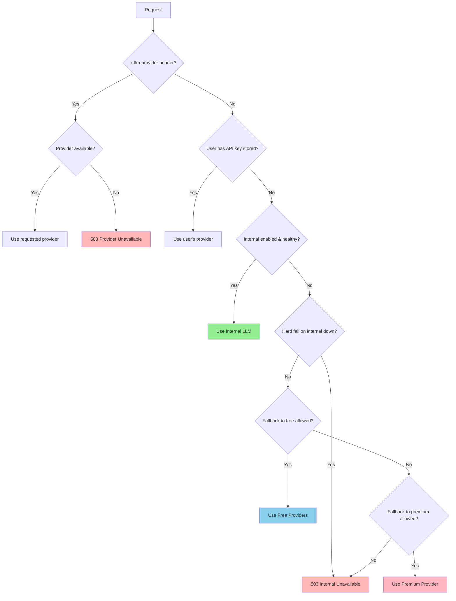

# LLM Provider Configuration Guide

**Date**: October 22, 2025
**Version**: v12.3.0
**Status**: Production Ready

---

## Overview

CacheGPT now uses a **provider-agnostic LLM system** with **internal-first priority**. The default behavior ensures that:

1. ✅ **Internal/native LLM is the first choice** for all requests
2. ✅ **Premium providers (Anthropic/OpenAI) are NEVER used automatically**
3. ✅ **Explicit configuration controls all fallback behavior**
4. ✅ **Per-request overrides are supported via headers**

**IMPORTANT**: Presence of `ANTHROPIC_API_KEY` in your environment does **NOT** change provider selection. Anthropic is only used when explicitly requested.

---

## Provider Priority

### Default Priority Order

```
1. Per-request override (x-llm-provider header)
   └─ If allowed and provider is available

2. Internal LLM
   └─ If enabled and healthy

3. Free external providers
   └─ If internal unavailable AND fallback allowed

4. Premium providers
   └─ If explicitly allowed via LLM_ALLOW_FALLBACK_TO_PREMIUM=true

5. 503 Service Unavailable
   └─ If no providers available
```

### Flowchart



---

## Environment Variables

### Core Configuration

| Variable | Default | Description |
|----------|---------|-------------|
| `LLM_PROVIDER` | `internal` | Default provider: `internal`, `free`, `anthropic`, `openai` |
| `LLM_ALLOW_OVERRIDE` | `true` | Allow per-request provider override via header |
| `LLM_LOG_PROVIDER_SELECTION` | `true` | Log provider selection decisions |

### Internal LLM Configuration

| Variable | Default | Description |
|----------|---------|-------------|
| `INTERNAL_LLM_ENABLED` | `true` | Enable/disable internal provider |
| `INTERNAL_LLM_URL` | `http://localhost:8080` | Base URL for internal LLM |
| `INTERNAL_LLM_API_KEY` | (empty) | Optional API key for internal LLM |
| `INTERNAL_LLM_MODEL` | `default` | Model name for internal LLM |
| `INTERNAL_LLM_HEALTH_URL` | `http://localhost:8080/health` | Health check endpoint |
| `INTERNAL_LLM_HEALTH_INTERVAL` | `30000` | Health check cache duration (ms) |
| `INTERNAL_LLM_TIMEOUT` | `30000` | Request timeout (ms) |

### Fallback Behavior

| Variable | Default | Description |
|----------|---------|-------------|
| `LLM_ALLOW_FALLBACK_TO_FREE` | `true` | Allow fallback to Groq/OpenRouter/HuggingFace |
| `LLM_ALLOW_FALLBACK_TO_PREMIUM` | `false` | Allow fallback to Anthropic/OpenAI |
| `LLM_HARD_FAIL_ON_INTERNAL_DOWN` | `true` | Return 503 if internal down (no fallback) |

### Free Provider API Keys

| Variable | Required | Description |
|----------|----------|-------------|
| `GROQ_API_KEY` | No | Groq API key for free LLama models |
| `OPENROUTER_API_KEY` | No | OpenRouter API key for free models |
| `HUGGINGFACE_API_KEY` | No | HuggingFace API key for Mixtral |

### Premium Provider API Keys

| Variable | Required | Description |
|----------|----------|-------------|
| `ANTHROPIC_API_KEY` | No* | Anthropic API key (used ONLY when explicit) |
| `OPENAI_API_KEY` | No* | OpenAI API key (used ONLY when explicit) |
| `GOOGLE_AI_API_KEY` | No* | Google AI API key (used ONLY when explicit) |
| `PERPLEXITY_API_KEY` | No* | Perplexity API key (used ONLY when explicit) |

**\*Note**: These keys are ONLY used when:
1. Explicitly requested via `x-llm-provider` header
2. User has stored their own key
3. Fallback is explicitly allowed via `LLM_ALLOW_FALLBACK_TO_PREMIUM=true`

---

## Configuration Examples

### Example 1: Production (Internal-First)

```bash
# Default provider
LLM_PROVIDER=internal

# Internal LLM configuration
INTERNAL_LLM_ENABLED=true
INTERNAL_LLM_URL=http://internal-llm:8080
INTERNAL_LLM_API_KEY=internal-secret-key
INTERNAL_LLM_MODEL=llama-3-70b

# Strict mode: no fallbacks
LLM_HARD_FAIL_ON_INTERNAL_DOWN=true
LLM_ALLOW_FALLBACK_TO_FREE=false
LLM_ALLOW_FALLBACK_TO_PREMIUM=false

# Allow per-request overrides
LLM_ALLOW_OVERRIDE=true

# Premium keys (for explicit requests only)
ANTHROPIC_API_KEY=sk-ant-...  # ← Does NOT change default behavior
OPENAI_API_KEY=sk-...         # ← Does NOT change default behavior
```

**Behavior**:
- All requests use internal LLM by default
- If internal is down → 503 error (no fallback)
- Users can override via `x-llm-provider: anthropic` header
- Anthropic/OpenAI keys are only used when explicitly requested

---

### Example 2: Development (Free Providers)

```bash
# Default to free providers
LLM_PROVIDER=free

# Disable internal (not running locally)
INTERNAL_LLM_ENABLED=false

# Free provider keys
GROQ_API_KEY=gsk_...
OPENROUTER_API_KEY=sk-or-...
HUGGINGFACE_API_KEY=hf_...

# Allow fallback to premium if free fails
LLM_ALLOW_FALLBACK_TO_FREE=true
LLM_ALLOW_FALLBACK_TO_PREMIUM=true

# Premium keys (for fallback)
ANTHROPIC_API_KEY=sk-ant-...
```

**Behavior**:
- Uses Groq/OpenRouter/HuggingFace by default
- If all free providers fail → fallback to Anthropic
- Internal LLM is disabled

---

### Example 3: Anthropic-Compatible Mode

```bash
# Default to Anthropic
LLM_PROVIDER=anthropic

# Disable internal
INTERNAL_LLM_ENABLED=false

# Only Anthropic key
ANTHROPIC_API_KEY=sk-ant-...

# No fallbacks
LLM_ALLOW_FALLBACK_TO_FREE=false
LLM_ALLOW_FALLBACK_TO_PREMIUM=false
```

**Behavior**:
- All requests use Anthropic by default
- Compatible with `/v1/messages` Anthropic API format
- No fallback if Anthropic fails

---

### Example 4: Hybrid (Internal + Free Fallback)

```bash
# Default to internal
LLM_PROVIDER=internal

# Internal LLM
INTERNAL_LLM_ENABLED=true
INTERNAL_LLM_URL=http://localhost:8080

# Allow fallback to free (but not premium)
LLM_HARD_FAIL_ON_INTERNAL_DOWN=false
LLM_ALLOW_FALLBACK_TO_FREE=true
LLM_ALLOW_FALLBACK_TO_PREMIUM=false

# Free provider keys
GROQ_API_KEY=gsk_...
OPENROUTER_API_KEY=sk-or-...

# Premium keys (ignored unless explicitly requested)
ANTHROPIC_API_KEY=sk-ant-...
```

**Behavior**:
- Uses internal LLM by default
- If internal is down → fallback to Groq/OpenRouter
- Anthropic key exists but is NOT used automatically
- Users can still override with `x-llm-provider: anthropic`

---

## Per-Request Override

### Using `x-llm-provider` Header

```bash
# Default request (uses internal)
curl -X POST http://localhost:3000/api/v2/unified-chat \
  -H "Content-Type: application/json" \
  -d '{"messages": [{"role": "user", "content": "Hello"}]}'

# Override to Anthropic
curl -X POST http://localhost:3000/api/v2/unified-chat \
  -H "Content-Type: application/json" \
  -H "x-llm-provider: anthropic" \
  -d '{"messages": [{"role": "user", "content": "Hello"}]}'

# Override to free providers
curl -X POST http://localhost:3000/api/v2/unified-chat \
  -H "Content-Type: application/json" \
  -H "x-llm-provider: free" \
  -d '{"messages": [{"role": "user", "content": "Hello"}]}'
```

### Valid Provider Names

- `internal` - Internal/native LLM
- `free` - Free external providers (Groq/OpenRouter/HuggingFace)
- `anthropic` - Anthropic Claude
- `openai` - OpenAI GPT
- `google` - Google Gemini
- `perplexity` - Perplexity AI

---

## Response Headers

All responses include provider selection metadata:

```
x-request-id: req_1234567890_abc123
x-llm-provider-intent: internal
x-llm-provider-used: internal
```

| Header | Description |
|--------|-------------|
| `x-request-id` | Unique request identifier for logging |
| `x-llm-provider-intent` | What provider was requested/intended |
| `x-llm-provider-used` | What provider was actually used |

**Example**:
```
x-request-id: req_1729612345_xyz789
x-llm-provider-intent: auto
x-llm-provider-used: internal
```

---

## Error Handling

### 503 Service Unavailable

**Scenario 1**: Internal LLM is down and hard-fail is enabled

```json
{
  "error": "Internal LLM service is unavailable. Please try again later.",
  "code": "PROVIDER_UNAVAILABLE",
  "requestId": "req_1729612345_xyz789",
  "hint": "Check LLM provider configuration or try again later"
}
```

**Scenario 2**: Requested provider is not available

```json
{
  "error": "Requested provider 'anthropic' is not available. Please check configuration.",
  "code": "PROVIDER_UNAVAILABLE",
  "requestId": "req_1729612345_xyz789",
  "hint": "Check LLM provider configuration or try again later"
}
```

### 500 Internal Server Error

**Scenario**: Provider call failed

```json
{
  "error": "Anthropic API error: 429 Too Many Requests",
  "requestId": "req_1729612345_xyz789"
}
```

---

## Logging

Provider selection decisions are logged at INFO level:

```json
{
  "rid": "req_1729612345_xyz789",
  "path": "/api/v2/unified-chat",
  "intent": "auto",
  "selected": "internal",
  "reason": "Internal LLM is enabled and healthy",
  "internalHealthy": true,
  "timestamp": "2025-10-22T12:34:56.789Z"
}
```

Disable logging:
```bash
LLM_LOG_PROVIDER_SELECTION=false
```

---

## Migration Guide

### Migrating from Old System

**Old Behavior** (BUG):
- `/v1/messages` always used Anthropic
- `/v2/unified-chat` fell back to Anthropic if free providers failed
- Presence of `ANTHROPIC_API_KEY` changed behavior

**New Behavior** (FIX):
- Both endpoints use provider resolver
- Internal LLM is the default
- `ANTHROPIC_API_KEY` only used when explicit

### Steps to Migrate

1. **Set up internal LLM** (if not already):
   ```bash
   INTERNAL_LLM_ENABLED=true
   INTERNAL_LLM_URL=http://your-internal-llm:8080
   ```

2. **Configure fallback behavior**:
   ```bash
   LLM_HARD_FAIL_ON_INTERNAL_DOWN=true  # Or false for fallback
   LLM_ALLOW_FALLBACK_TO_PREMIUM=false  # Keep Anthropic explicit-only
   ```

3. **Test with new endpoint**:
   ```bash
   curl -X POST http://localhost:3000/api/v2/unified-chat \
     -H "Content-Type: application/json" \
     -d '{"messages": [{"role": "user", "content": "test"}]}'

   # Check response headers
   # x-llm-provider-used should be "internal"
   ```

4. **Update API clients** (if using `/v1/messages`):
   - Old: Always went to Anthropic
   - New: Goes to internal by default
   - To keep Anthropic: Add `x-llm-provider: anthropic` header

---

## Testing

### Test Scripts

```bash
cd /home/rolo/cachegpt/tools/repro

# Test provider selection
export CACHEGPT_URL="http://localhost:3000"
export CACHEGPT_API_KEY="cgpt_sk_..."
npx ts-node test-provider-selection.ts
```

### Expected Output

```
✅ Test 1: Default provider is internal (not Anthropic)
✅ Test 2: Override to Anthropic via header
✅ Test 3: Override to free providers via header
✅ Test 4: Invalid provider override returns error

Total: 4 | Passed: 4 | Failed: 0

✅ All tests passed! Internal LLM is correctly prioritized.
```

---

## Troubleshooting

### Internal LLM Not Being Used

**Symptom**: Requests use free/premium providers instead of internal

**Check**:
1. Is `INTERNAL_LLM_ENABLED=true`?
2. Is internal LLM healthy? Check `/health` endpoint
3. Check logs for `[INTERNAL-LLM-HEALTH]` messages

**Fix**:
```bash
# Verify health
curl http://localhost:8080/health

# Check config
echo $INTERNAL_LLM_ENABLED
echo $INTERNAL_LLM_URL
```

### Anthropic Being Used Automatically

**Symptom**: Anthropic is used even without `x-llm-provider` header

**This should NOT happen!** If it does:

1. Check `LLM_ALLOW_FALLBACK_TO_PREMIUM` is `false`
2. Check `LLM_PROVIDER` is NOT set to `anthropic`
3. Check user doesn't have Anthropic key stored in database
4. Review logs for provider selection reason

### 503 Errors

**Symptom**: All requests return 503

**Possible Causes**:
1. Internal LLM is down + `LLM_HARD_FAIL_ON_INTERNAL_DOWN=true`
2. No providers configured
3. Requested provider not available

**Fix**:
```bash
# Allow fallback
LLM_HARD_FAIL_ON_INTERNAL_DOWN=false
LLM_ALLOW_FALLBACK_TO_FREE=true

# Or configure free providers
GROQ_API_KEY=...
```

---

## FAQ

### Q: Will my Anthropic API key still work?

**A**: Yes! But it's only used when:
- You set `x-llm-provider: anthropic` header
- You set `LLM_PROVIDER=anthropic` in config
- You enable `LLM_ALLOW_FALLBACK_TO_PREMIUM=true` and all other providers fail

### Q: How do I disable internal LLM temporarily?

```bash
INTERNAL_LLM_ENABLED=false
LLM_PROVIDER=free
```

### Q: Can I use Anthropic for some users and internal for others?

**A**: Yes! Users can store their own Anthropic keys in the dashboard. Those users will use their keys while others use internal LLM.

### Q: What happens if I set `LLM_ALLOW_FALLBACK_TO_PREMIUM=true`?

**A**: If internal and free providers both fail, the system will try Anthropic/OpenAI as a last resort. This is NOT recommended for production.

---

## Related Documentation

- [Provider Bug Analysis](/docs/PROVIDER_BUG_ANALYSIS.md) - Root cause analysis
- [Authentication Flow](/docs/auth-flow.md) - API key authentication
- [API Key Usage](/API_KEY_USAGE.md) - User guide

---

**Document Version**: 1.0
**Last Updated**: October 22, 2025
