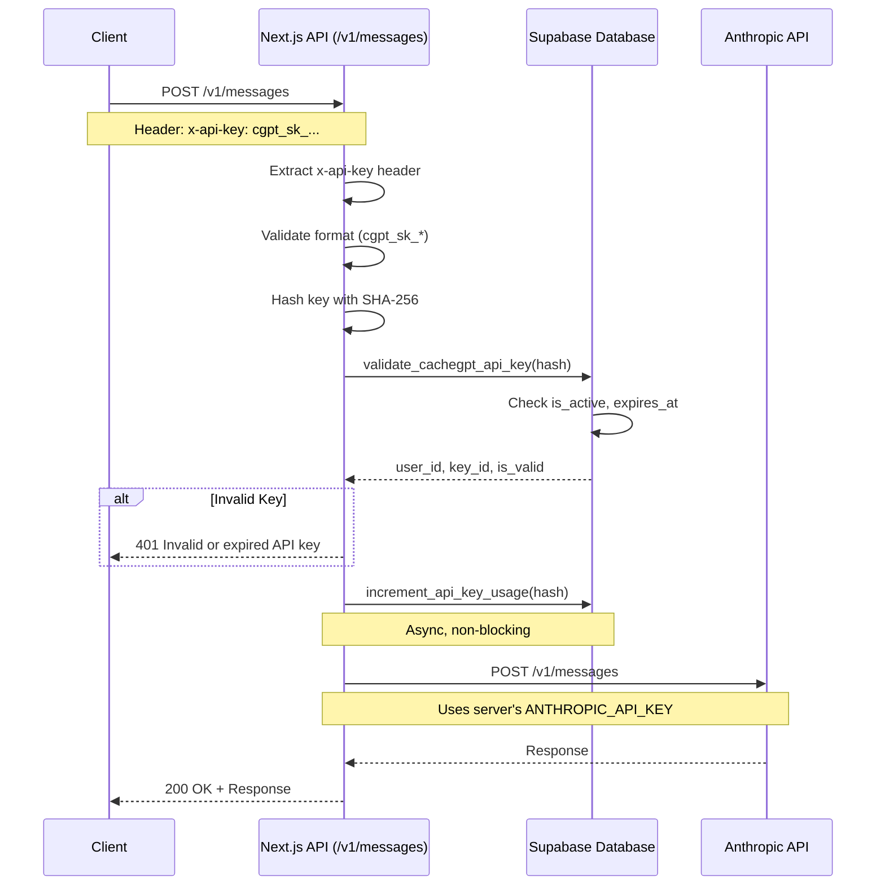

# CacheGPT API Key Authentication - Reproduction & Testing

## Overview

This directory contains tools to test and diagnose CacheGPT API key authentication for the `/v1/messages` endpoint.

## System Architecture

### Authentication Flow

```
Client Request
    │
    ├─→ Header: x-api-key: cgpt_sk_...
    │   Header: Content-Type: application/json
    │
    ↓
OPTIONS Preflight (if CORS required)
    │
    ├─→ Returns: Access-Control-Allow-Origin: *
    │           Access-Control-Allow-Methods: POST, OPTIONS
    │           Access-Control-Allow-Headers: Content-Type, x-api-key, anthropic-version
    │
    ↓
POST /v1/messages
    │
    ├─→ Extract x-api-key header
    ├─→ Validate format (must start with cgpt_sk_)
    ├─→ Hash key with SHA-256
    ├─→ Call validate_cachegpt_api_key(hash) RPC
    │   │
    │   ├─→ Check: key_hash exists
    │   ├─→ Check: is_active = true
    │   ├─→ Check: expires_at is NULL OR > NOW()
    │   ├─→ Return: user_id, key_id, is_valid
    │
    ├─→ If invalid: 401 "Invalid or expired API key"
    │
    ├─→ If valid: Increment usage counter (async)
    │
    ├─→ Use server's ANTHROPIC_API_KEY (NOT user's key)
    │
    ├─→ Call Anthropic API with @anthropic-ai/sdk
    │
    └─→ Return response to client
```

## Authentication Methods in CacheGPT

CacheGPT supports **3 authentication methods** (in priority order):

### 1. CacheGPT API Keys (cgpt_sk_*)
- **Issuer**: CacheGPT backend (`/api/api-keys`)
- **Consumer**: External applications via `/v1/messages`
- **Format**: `cgpt_sk_` + 64 hex chars (32 random bytes)
- **Storage**: SHA-256 hash in `cachegpt_api_keys` table
- **Header**: `x-api-key: cgpt_sk_...`
- **Purpose**: Programmatic access to Anthropic-compatible endpoint

### 2. Bearer Tokens (Supabase JWT)
- **Issuer**: Supabase Auth
- **Consumer**: CLI users, OAuth sessions
- **Format**: JWT token
- **Header**: `Authorization: Bearer <jwt>`
- **Purpose**: User session authentication

### 3. Cookie Sessions
- **Issuer**: Supabase Auth via Next.js
- **Consumer**: Web app users
- **Storage**: HTTP-only cookies
- **Purpose**: Browser-based authentication

## Endpoints

### Issuer (API Key Management)
- `POST /api/api-keys` - Generate new CacheGPT API key
- `GET /api/api-keys` - List user's API keys
- `DELETE /api/api-keys?id=<uuid>` - Revoke API key

### Consumer (API Key Validation)
- `POST /v1/messages` - Anthropic-compatible chat endpoint
  - Validates CacheGPT API key
  - Uses server's Anthropic key for actual API calls
  - Returns Anthropic-formatted responses

### Other Authenticated Endpoints
- `POST /api/v2/unified-chat` - Main chat endpoint (all 3 auth methods)

## Files in This Directory

### 1. `test-api-key-auth.js`
Node.js script to test all authentication scenarios:
- ✅ Valid API key
- ❌ Missing header
- ❌ Wrong header name (Authorization instead of x-api-key)
- ❌ Invalid key format
- ❌ Expired key
- ❌ Revoked key

### 2. `generate-test-key.sh`
Bash script to generate a test API key via the CacheGPT API.
Requires a valid Supabase Bearer token.

### 3. `test-cors-preflight.sh`
cURL-based script to test CORS preflight (OPTIONS) requests.

### 4. `test-minimal-client.html`
Minimal HTML page to test from a browser (CORS scenario).

## Usage

### Prerequisites

1. **Running CacheGPT instance** (local or production)
2. **Valid Supabase Bearer token** (for key generation)
3. **Node.js** (v18+) or cURL installed

### Step 1: Generate a Test API Key

```bash
cd /home/rolo/cachegpt/tools/repro

# Set your Supabase Bearer token
export SUPABASE_TOKEN="your_supabase_jwt_token_here"

# Generate a new API key
./generate-test-key.sh
```

This will output a key like: `cgpt_sk_abc123def456...`

**IMPORTANT**: Save this key! It's only shown once.

### Step 2: Test Authentication

```bash
# Set your generated API key
export CACHEGPT_API_KEY="cgpt_sk_..."

# Run the test suite
node test-api-key-auth.js
```

Expected output:
```
✅ Valid key: 200 OK
❌ Missing header: 401 Unauthorized
❌ Wrong header name: 401 Unauthorized
❌ Invalid format: 401 Unauthorized
```

### Step 3: Test CORS Preflight

```bash
./test-cors-preflight.sh
```

Expected output:
```
✅ CORS preflight successful
Access-Control-Allow-Origin: *
Access-Control-Allow-Methods: POST, OPTIONS
Access-Control-Allow-Headers: Content-Type, x-api-key, anthropic-version
```

## Common Issues & Fixes

### Issue 1: 401 "Invalid or missing x-api-key header"

**Cause**: Header name mismatch or missing header

**Fix**: Ensure header is exactly `x-api-key`, not `Authorization` or `X-Api-Key`

```bash
# ❌ Wrong
curl -H "Authorization: Bearer cgpt_sk_..."

# ❌ Wrong (case sensitive)
curl -H "X-Api-Key: cgpt_sk_..."

# ✅ Correct
curl -H "x-api-key: cgpt_sk_..."
```

### Issue 2: 401 "Invalid or expired API key"

**Causes**:
1. Key doesn't exist in database
2. Key is revoked (is_active=false)
3. Key is expired (expires_at < NOW())
4. Hash mismatch (key was modified)

**Debug**:
```sql
-- Check if key exists (replace with your key hash)
SELECT id, key_name, is_active, expires_at, created_at
FROM cachegpt_api_keys
WHERE key_hash = encode(sha256('cgpt_sk_...'), 'hex');
```

### Issue 3: CORS Preflight Fails

**Cause**: Missing or incorrect CORS headers

**Fix**: Ensure `/v1/messages` OPTIONS handler returns:
```
Access-Control-Allow-Origin: *
Access-Control-Allow-Methods: POST, OPTIONS
Access-Control-Allow-Headers: Content-Type, x-api-key, anthropic-version
```

**Current Implementation**: `/home/rolo/cachegpt/app/api/v1/messages/route.ts:125-134`

### Issue 4: 500 "Anthropic API key not configured on server"

**Cause**: Missing `ANTHROPIC_API_KEY` in server environment

**Fix**: Add to `.env.local`:
```bash
ANTHROPIC_API_KEY=sk-ant-your_key_here
```

### Issue 5: Database Function Not Found

**Cause**: Migration `030_cachegpt_api_keys.sql` not applied

**Fix**:
```bash
psql -h <host> -U postgres -d postgres -f database-scripts/030_cachegpt_api_keys.sql
```

Or via environment:
```bash
PGPASSWORD="$SUPABASE_DB_PASSWORD" psql \
  -h "aws-0-us-east-1.pooler.supabase.com" \
  -p 6543 \
  -d "postgres" \
  -U "postgres.ntekfgvkbuzjwmftqchr" \
  -f database-scripts/030_cachegpt_api_keys.sql
```

## Security Notes

### What is Stored

| Data | Storage | Format |
|------|---------|--------|
| Full API key | NEVER stored | Only shown once on creation |
| Key hash | Database | SHA-256 hex (64 chars) |
| Key prefix | Database | First 16 chars of full key |

### Key Format

```
cgpt_sk_<64 hex characters>
         └─ 32 random bytes → hex encoded
```

Example: `cgpt_sk_a1b2c3d4e5f6...` (80 chars total)

### Validation Flow

1. **Client** sends full key: `cgpt_sk_abc123...`
2. **Server** hashes with SHA-256: `hash = sha256(key)`
3. **Database** looks up: `SELECT * FROM cachegpt_api_keys WHERE key_hash = hash`
4. **Validate**: `is_active AND (expires_at IS NULL OR expires_at > NOW())`

### Rate Limiting

- API keys inherit user's rate limits
- Tracked via `usage_count` and `last_used_at` columns
- Automatic increment on each valid request

## Architecture Diagram



## Related Documentation

- [API_KEY_USAGE.md](/home/rolo/cachegpt/API_KEY_USAGE.md) - User-facing guide
- [STATUS_2025_09_24.md](/home/rolo/cachegpt/STATUS_2025_09_24.md) - System status
- [database-scripts/030_cachegpt_api_keys.sql](/home/rolo/cachegpt/database-scripts/030_cachegpt_api_keys.sql) - Schema

## Troubleshooting Checklist

Run through this checklist if authentication is failing:

- [ ] API key starts with `cgpt_sk_` and is 80 characters total
- [ ] Header name is exactly `x-api-key` (lowercase)
- [ ] Database migration `030_cachegpt_api_keys.sql` is applied
- [ ] Key exists in database: `SELECT * FROM cachegpt_api_keys WHERE key_prefix = 'cgpt_sk_...'`
- [ ] Key is active: `is_active = true`
- [ ] Key is not expired: `expires_at IS NULL OR expires_at > NOW()`
- [ ] Server has `ANTHROPIC_API_KEY` in environment
- [ ] CORS headers are returned for OPTIONS requests
- [ ] Database functions have EXECUTE permissions for `anon` role
